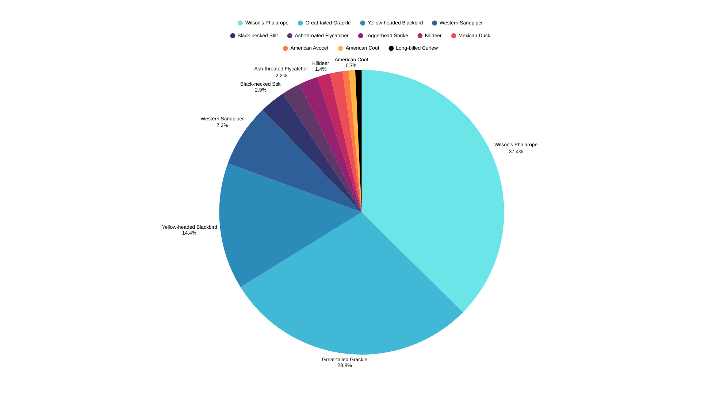

# CS167-eBird_Data_Analysis_Project_Group4W
In this project, we will perform some analytical tasks on a dataset that represents bird observations. We will combine this dataset with a ZIP code dataset to determine the ZIP code for each point. Then, we will perform two analytical tasks, one based on ZIP codes, and one based on time. The results will be visualized using existing tools.

# Task assignments:
# Task 1: Desai, Jia
# Task 2: Lee, Justin
# Task 3: Padte, Yana
After completing the temporal analysis on the bird data, the following image was generated to show the breakdown of the number of observations of species on the 1k dataset from 03/15/2011 to 08/17/2011

# Task 4: Vasilev, Arsenii
# Task 5: Wang, Zijun
